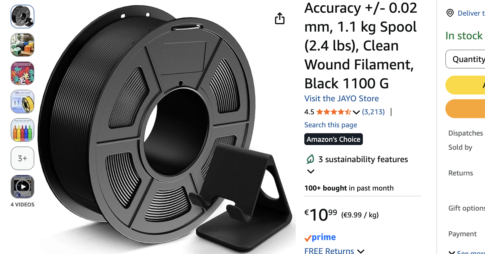
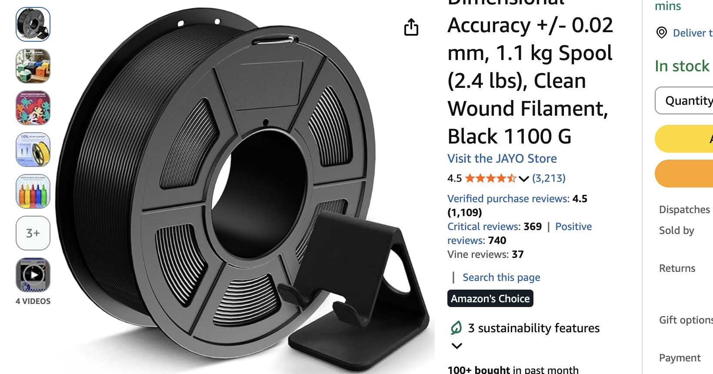

# Better Reviews for Amazon

Better Reviews for Amazon adds a small review summary box to Amazon product pages. It helps you quickly understand review quality by showing totals for verified purchase reviews only.

It excludes Vine reviews from rating calculations. Vine reviews are written by reviewers who receive products for free in exchange for feedback, which can make them less reliable.

- Chrome extension: [Chrome Web Store](https://chrome.google.com/webstore/detail/lcephgfijpdgdddilcjldnadamfoogme)
- Firefox add-on: [Firefox Add-ons](https://addons.mozilla.org/en-US/firefox/addon/better-reviews-for-amazon/)

The extension only works on Amazon pages. It runs locally in your browser, does not collect your data, does not send anything to a backend, and does not add referral links or tracking.

## Install

### Chrome extension

Install from the Chrome Web Store:

- [Better Reviews for Amazon](https://chrome.google.com/webstore/detail/lcephgfijpdgdddilcjldnadamfoogme)

### Firefox add-on

Install from Firefox Add-ons:

- [Better Reviews for Amazon](https://addons.mozilla.org/en-US/firefox/addon/better-reviews-for-amazon/)

### Userscript

1. Install Tampermonkey or Violentmonkey.
2. Open the Greasy Fork install page: [Better Reviews for Amazon on Greasy Fork](https://greasyfork.org/en/scripts/574410-better-reviews-for-amazon).
3. Click `Install this script`.
4. Alternative: open [`better-reviews-for-amazon.user.js`](./better-reviews-for-amazon.user.js) and install it in your userscript manager.

## Screenshots

Before:

After:

## Development

- Shared Amazon logic lives in [`src/core/`](./src/core/).
- Thin entry points live in [`src/userscript/`](./src/userscript/), [`src/chrome-extension/`](./src/chrome-extension/), and [`src/firefox-extension/`](./src/firefox-extension/).
- Chrome and Firefox manifests are generated from one shared base.
- All shared translations live in [`src/i18n/locales/`](./src/i18n/locales/).
- Add a new locale by creating one more JSON file with the same keys, then run `npm run build`.
- Extension icons are rendered from [`src/icon.svg`](./src/icon.svg) during build and added to both browser packages.
- Run `npm install`.
- Run `npm run build`.
- Run `npm run build:release` to create the store upload archives in `dist/release/`:
- Chrome: `better-reviews-for-amazon-chrome-<version>.zip`
- Firefox: `better-reviews-for-amazon-firefox-<version>.xpi`

## Contribute

Contributions are welcome on GitHub.

- Open an issue: [github.com/vrizo/better-reviews-for-amazon/issues](https://github.com/vrizo/better-reviews-for-amazon/issues)
- Open a pull request: [github.com/vrizo/better-reviews-for-amazon/pulls](https://github.com/vrizo/better-reviews-for-amazon/pulls)
- A good first contribution is improving translations in [`src/i18n/locales/`](./src/i18n/locales/).
- Store listing notes and copy live in [`docs/store-listing.md`](./docs/store-listing.md).

## Notes

- Requires a signed-in Amazon session.
- Review numbers are cached for 24 hours.
- The script reads Amazon review filter pages and shows the totals on the product page.
- This project is not affiliated with or endorsed by Amazon.
- This project is released under the MIT License.

## Docs

Project notes and research live in [`docs/`](./docs/).
